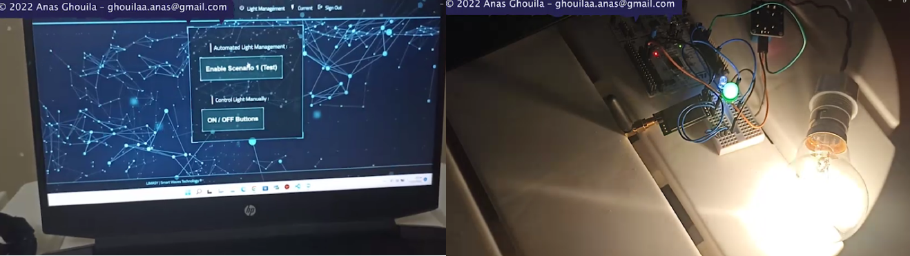

# 💡 Light-Management-System
Conducted as part of an **end-of-studies project at SWATEK**, this work focused on the development of an **IoT-based smart public lighting solution**. A prototype was designed including two custom electronic boards, **Device** and **Gateway**, communicating wirelessly. The Gateway ensured data transmission to a dedicated server (**LIMASY**), which enabled system monitoring, control, and scenario-based management while ensuring security and connectivity.

## 📄 Description
This end-of-study project realized within the company SWATEK aims to design and create a system aimed at
developing an IoT solution for intelligent public lighting. In this context, a design of a prototype is implemented
while designing two electronic boards called Device and Gateway and while inserting a wireless communication
between them. The role of the Gateway is to let data pass via the LoRa protocol to another protocol called
the Internet. Indeed, all the information received at the Gateway is sent to the server created LIMASY using
the HTTPS protocol and then to the server application for visualization and control by scenarios.
This server created, provides everything necessary in terms of security, connectivity, and public lighting system management.

**Keywords** : IoT, LoRa, WiFi, HTTPS, STM32-Nucleo L476RG, STM32Cube IDE, C/C++.

---        

## 🎯 Aims
The **LIMASY** project, as its name suggests, is a **public lighting management system** specifically designed to be installed inside public lighting cabinets or enclosures. It is intended to **serve municipal technicians and public lighting personnel by enabling real-time and remote control of the switching on and off of lighting lines**. This control is carried out through a web server application that provides the necessary graphical interfaces to define lighting commands based on scenarios, thereby **optimizing energy consumption**.

---        
## ⚙️ Tools and Technologies

### Hardware 
- STM32 Nucleo-L476RG microcontroller board
- NodeMCU ESP8266 microcontroller board
- LoRa E32 (868T20D) Module with 868 MHz SMA Antenna
- 12V Switched-Mode Power Supply
- 4-Relay Module
  
### Software
- **STM32CubeIDE** : An integrated development environment (IDE) for STM32 microcontrollers, providing code editing, compilation, debugging, and peripheral configuration tools.
- **Arduino IDE** : A user-friendly integrated development environment for programming Arduino boards, supporting code writing, uploading, and serial monitoring.
- **C (STM32CubeIDE), C++ (Arduino IDE)** : programming languages.
- **Proteus ISIS** : A software tool for designing and simulating electronic circuits and embedded systems.
---
## 🎬 Preview
This demo provides a practical overview of the project in action, showcasing an early prototype that connects an embedded control board and a gateway with an IoT platform. It highlights key functions such as remote switching, real-time status updates, and scenario-based automation, demonstrating the system’s potential for smart street lighting.

[▶️ Download Demo_PFE video](Demo_PFE.mp4)

## 🎤 Demo v0 – Explained Walkthrough
This earlier demo provides a narrated walkthrough of the prototype in French, explaining its key components and functionality. Created for academic review, it demonstrates the system’s main functions and overall operation in a clear and structured way.

 

[▶️ Download Demo_PFE_v0 video](Demo_PFE_version_0.mp4)

